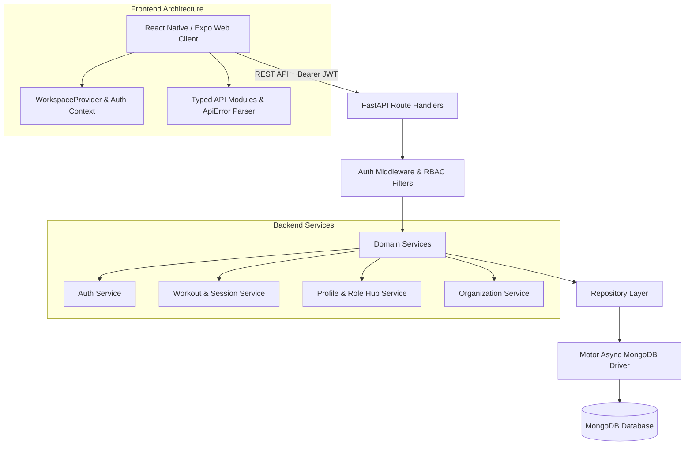
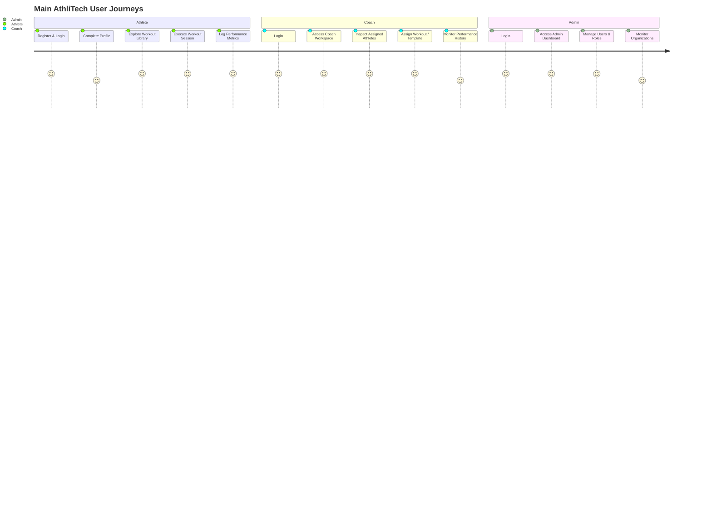

# AthliTech — Athletic Performance & Workspace Management Platform

AthliTech is a full-stack athletic performance management and workspace orchestration platform. It is designed to connect athletes, coaches, and sports organization administrators in a unified application ecosystem for tracking training routines, logging physical metrics, assigning workouts, and managing multi-role organizational permissions.

---

## 1. Project Overview

AthliTech addresses the fragmentation of athletic management workflows:
* **For Athletes:** Replaces manual notebook tracking with structured workout execution, history logs, and direct coach communication.
* **For Coaches:** Provides central visibility over assigned athletes ("My Athletes"), workout assignments (custom and template-based), and completed workout telemetry.
* **For Organizations & Admins:** Offers single-pane management over users, roles, granular permissions, and multi-tenant workspace switching.

> [!NOTE]
> **Prototype Scope vs. Future Ambitions:**
> The current application is a fully functional data-driven performance management baseline prototype (v1.2.0-stable). It handles user authentication, workspace role profile switching, workout assignment, exercise execution tracking, and performance logging. AI-driven features (such as personalized workload adaptation models or automated predictive analytics) are **future architectural ambitions** and are not implemented as active AI models in this release.

---

## 2. Key Features

The current implementation includes the following verified features:

* **Authentication & Role Registration:**
  * Multi-role registration (Athlete / Coach).
  * JWT Bearer authentication with 60-minute token expiration.
  * Secure local token storage (Expo `SecureStore` on Native iOS/Android, `localStorage` on Web).
* **Role Profile & Workspace Management (Role Hub):**
  * Single-account multi-role system (`role_profiles` & `memberships`).
  * Seamless workspace switching without re-authenticating.
  * Interactive role profile activation (`athlete`, `coach`, `organization`).
* **Athlete Workspace & Workouts:**
  * Athlete dashboard displaying workout completion progress and assigned coach details.
  * **Workout Library:** Desktop 3-column responsive card layout with sport, category, difficulty, and equipment badges.
  * **My Workouts:** Personal workout hub tracking assigned workouts and status state (`pending`, `completed`, `skipped`).
  * **Workout Execution Runner:** Interactive session runner tracking workout timers, exercise checklists, and notes.
  * **Performance Logging:** Quantitative athletic performance logging (e.g., 100m sprint times, bench press weights).
* **Coach Workspace & Athlete Management:**
  * Coach dashboard with athlete activity summaries and workout assignment status.
  * **My Athletes:** List of assigned athletes paired via MongoDB `athletes` collection source-of-truth.
  * **Athlete Details Inspection:** Detailed view of athlete performance logs, workout status history, and metrics.
  * **Workout Assignment System:** Assign curated workout templates or custom workouts directly to specific athletes, including custom set, rep, and duration specifications.
* **Admin Workspace & User Management:**
  * Admin dashboard with global system counters (Users, Roles, Athletes, Workouts, Performances).
  * User account directory and role/permission management interface.
  * Organization workspace overview and invitation tracking.
* **Centralized API Error Handling:**
  * Custom `ApiError` utility converting backend HTTP errors and Pydantic validation arrays into clean user messages.
  * Partial data load fault tolerance using `Promise.allSettled` on complex dashboard screens.
* **Responsive Desktop & Web Layouts:**
  * Dynamic layout math for desktop 3-column workout grids, bounded modal list scrolling, and mobile flex wrapping.

---

## 3. Technology Stack

| Layer | Technology / Package | Version / Description |
| :--- | :--- | :--- |
| **Frontend Framework** | React Native / Expo | Expo SDK `~54.0.36`, React `19.1.0`, React Native Web `~0.21.0` |
| **Routing** | Expo Router | `~6.0.24` (File-based route navigation) |
| **Language & Typings** | TypeScript | `~5.9.2` |
| **State & Graphics** | Zustand / Three.js | State management via `zustand`, 3D landing visual effects via `three` |
| **Backend Framework** | FastAPI (Python) | Asynchronous Python REST framework (`Python 3.12`) |
| **Database** | MongoDB | Managed via `Motor` (`AsyncIOMotorClient`) & `PyMongo` |
| **Authentication** | OAuth2 / JWT / bcrypt | Passlib (`bcrypt`), PyJWT / python-jose (`HS256`) |
| **Validation** | Pydantic | Pydantic v2 schemas on backend, TypeScript interfaces on frontend |
| **Testing** | Pytest / TypeScript CLI | `pytest` for Python backend (22 suites), `tsc` for frontend type checks |
| **Web Build** | Expo Export CLI | Static Web Export bundle bundler (`dist/`) |

---

## 4. System Architecture



---

## 5. Project Structure

```
athlitech-app/
├── backend/                        # FastAPI Backend Application
│   ├── core/                       # Core security (JWT, bcrypt), config, constants
│   ├── database/                   # Motor MongoDB client & collection handles
│   ├── models/                     # Domain data models (Account, Organization, Performance, Workout)
│   ├── schemas/                    # Pydantic validation schemas
│   ├── repositories/              # MongoDB repository abstraction layer
│   ├── services/                  # Business logic (auth, profile, workout, organization, role hub)
│   ├── routes/                    # API endpoints (auth, user, role, workout, performance, etc.)
│   ├── scripts/                   # Data seed scripts (seed_workout_library.py, seed_users.py)
│   └── tests/                     # Pytest suite (22 comprehensive unit & integration tests)
│
├── frontend/                       # React Native / Expo Frontend Application
│   ├── src/
│   │   ├── api/                   # Typed REST API modules (auth.ts, workout.ts, profile.ts, etc.)
│   │   ├── app/                   # Expo Router screen pages (login, role-hub, workout-library, etc.)
│   │   ├── components/            # Reusable UI components (WorkoutCard, Layout containers)
│   │   ├── context/               # WorkspaceContext (role profile state & workspace switching)
│   │   ├── features/              # Feature modules (admin, athletes, auth, coaches, workouts)
│   │   ├── hooks/                 # Custom React hooks (useWorkoutSession.ts)
│   │   └── utils/                 # Utilities (ApiError.ts centralized error parser)
│   └── package.json               # Frontend dependencies & scripts
│
└── README.md                       # Project documentation
```

---

## 6. Authentication & Authorization

AthliTech implements Role-Based Access Control (RBAC) and dynamic granular permissions:

1. **Registration & Credential Security:** Passwords are hashed using `bcrypt` via Passlib before persisting to the MongoDB `users` collection.
2. **JWT Authentication:** Successful authentication (`POST /auth/login`) returns a signed JWT access token (`HS256`, 60-minute expiration).
3. **Protected API Requests:** Clients attach tokens in the `Authorization: Bearer <token>` HTTP header. Backend dependencies (`get_current_user`, `require_admin`) decode and validate requests against user collection records.
4. **Role Profiles & Workspace Switching:** Single user accounts map to multiple active role profiles (`role_profiles` and `memberships` collections). Users can activate additional workspace roles (`athlete`, `coach`, `organization`) and switch active dashboards dynamically in the Role Hub without re-authenticating.

---

## 7. Main User Workflows



### End-to-End Workflow Summaries

* **Athlete Journey:** `Registration` → `Login` → `Profile Completion` → `Workspace Unlock` → `Athlete Dashboard` → `Workout Library` → `My Workouts` → `Start Workout` → `Complete Workout` → `Performance Log`.
* **Coach Journey:** `Login` → `Coach Workspace` → `My Athletes` → `Athlete Details` → `Assign Workout (Custom or Template)` → `Assigned Workout Received by Athlete` → `Performance Monitoring`.
* **Admin Journey:** `Login` → `Admin Dashboard` → `User Management` → `Role/Permission Management` → `Organization Management`.
* **Workspace Journey:** `Role Hub` → `Activate/Deactivate Role` → `Switch Active Workspace` → `Target Workspace Rendered`.

---

## 8. API Overview

| Method | Endpoint | Purpose | Role / Auth Requirement |
| :--- | :--- | :--- | :--- |
| `POST` | `/auth/register` | Register a new user account | Public |
| `POST` | `/auth/login` | Authenticate credentials and receive JWT | Public |
| `GET` | `/profile/me` | Fetch authenticated user profile | Bearer (Authenticated) |
| `POST` | `/profile/complete-athlete` | Complete athlete physical profile details | Bearer (Athlete) |
| `POST` | `/profile/complete-coach` | Complete coach credentials & bio | Bearer (Coach) |
| `GET` | `/role-profiles/status` | Fetch active workspace role profiles | Bearer (Authenticated) |
| `POST` | `/role-profiles/activate` | Activate a workspace role (`athlete`/`coach`/`org`) | Bearer (Authenticated) |
| `GET` | `/workouts/templates` | Fetch workout template library | Bearer (Authenticated) |
| `POST` | `/workouts/create` | Create/assign a workout plan | Bearer (`coach` / `admin`) |
| `GET` | `/workouts/athlete/{id}` | Fetch workouts assigned to an athlete | Bearer (Authenticated) |
| `PUT` | `/workouts/{id}/status` | Update workout status (`pending`/`completed`/`skipped`) | Bearer (Athlete) |
| `POST` | `/performance/add` | Log an athletic performance entry | Bearer (Authenticated) |
| `GET` | `/performance/athlete/{id}` | Fetch performance history for an athlete | Bearer (Authenticated) |
| `GET` | `/athletes/coach/{coach_id}` | Fetch list of athletes assigned to a coach | Bearer (`coach` / `admin`) |
| `GET` | `/organizations/my` | Fetch organization details for current account | Bearer (`organization` / `admin`) |
| `GET` | `/dashboard/admin/summary` | Fetch global system summary statistics | Bearer (`admin`) |

---

## 9. Database Overview

AthliTech utilizes MongoDB (managed asynchronously via Motor). Primary collections include:

* `users`: User authentication accounts, hashed passwords, base role, profile completion state.
* `athletes`: Athlete-specific details (sport, primary event, metrics, assigned `coach_id`).
* `workouts`: Workout plans, title, description, target sport, exercises list, and created-by reference.
* `performances` & `performance_logs`: Logged performance entries, metrics, values, unit, timestamp.
* `workout_assignments`: Mappings connecting workouts to target athletes with assignment status.
* `workout_sessions`: Active workout runner execution state and timer telemetry.
* `roles`: Dynamic RBAC role definitions and granular permission arrays.
* `accounts`, `organizations`, `memberships`, `role_profiles`: Multi-role account framework and workspace provisioning collections.

---

## 10. Error Handling

* **Backend Error Structure:** FastAPI endpoints raise structured `HTTPException` responses with detail strings or Pydantic validation error lists.
* **Frontend Centralized Parser:** `frontend/src/utils/ApiError.ts` parses response bodies into a typed `ApiError` class, handling HTTP status codes, validation arrays, and fallback error messages.
* **Partial Load Protection:** Dashboard screens (`AdminDashboard`, `AthleteDetailsScreen`, `CoachDetailsScreen`) execute sub-resource requests via `Promise.allSettled`, presenting available metrics even if an individual query encounters an error.

---

## 11. Testing & Verification Status

The current application baseline has been verified using automated and manual verification:

| Check | Result | Evidence |
| :--- | :--- | :--- |
| **Backend Pytest** | **PASSED** (22/22 suites) | Executed `PYTHONPATH=backend ./.venv/bin/pytest backend/tests/ -v` |
| **TypeScript Type Check** | **PASSED** (0 errors) | Executed `npx tsc --noEmit` in `frontend/` |
| **Expo Web Build** | **PASSED** (23 static routes) | Executed `npx expo export -p web` generating web bundle in `dist/` |

---

## 12. Responsive Design

* **Web & Desktop Viewports:** Optimized for standard desktop screens. Displays a strict 3-column Workout Library grid (`31.8%` card width), side-by-side metric dashboards, and nested scroll containers for modal lists.
* **Mobile Viewports:** Uses fluid layout wrapping (`flexWrap: 'wrap'`, single-column 100% card width).
* **Limitations:** Primary design verification was executed on Web/Desktop viewports. Ultra-narrow mobile device viewports may experience tight visual margins on complex multi-column table components.

---

## 13. Current Project Status

This codebase represents the **v1.2.0-stable Internship Release Candidate baseline**. It is a working full-stack prototype designed for demonstration, evaluation, and further feature development. It is not intended for high-concurrency production SaaS deployment without additional cloud infrastructure setup.

---

## 14. Known Limitations

* **AI Features:** Workout recommendations and AI performance insights use heuristic fallback rules rather than dynamic machine learning models.
* **Real-Time Data:** Dashboard data updates via REST API polling and manual refreshes; real-time WebSockets are not implemented.
* **Payment Gateways:** Subscription plan activation is simulated via workspace profile management (`/role-profiles/activate`); external payment provider APIs (e.g., Stripe) are not integrated.

---

## 15. Future Scope

* **AI Performance Engine:** Integration of machine learning models for adaptive athlete load calculation and injury prevention alerts.
* **Real-Time Telemetry:** WebSocket integration for live coach-athlete session monitoring and chat.
* **Wearable Integration:** Direct sync support for Apple HealthKit, Garmin, and Strava APIs.
* **Production Cloud Deployment:** Containerization (Docker) and Kubernetes orchestration for scalable production hosting.

---

## 16. Installation & Local Development

### Prerequisites
* **Python**: 3.10+ (Python 3.12 recommended)
* **Node.js**: v18+ & `npm`
* **Database**: Local MongoDB instance (`mongodb://localhost:27017`) or MongoDB Atlas URI

### 1. Backend Setup
```bash
# Navigate to backend directory
cd backend

# Create and activate Python virtual environment
python3 -m venv venv
source venv/bin/activate

# Install dependencies (or activate existing virtualenv)
pip install -r requirements.txt

# Create .env configuration file from example
cp .env.example .env
```

Configure `.env` with your environment values:
```env
MONGODB_URI=mongodb://localhost:27017
MONGODB_DATABASE=athlitech
JWT_SECRET=your-secure-jwt-secret-key
ALGORITHM=HS256
ACCESS_TOKEN_EXPIRE_MINUTES=60
FRONTEND_ORIGINS=http://localhost:8081,http://127.0.0.1:8081
```

Seed default workouts library and initial data:
```bash
python3 scripts/seed_workout_library.py
```

Start the FastAPI development server:
```bash
uvicorn main:app --reload --port 8000
```
Backend server runs at: `http://localhost:8000` (OpenAPI Swagger docs at `http://localhost:8000/docs`).

### 2. Frontend Setup
```bash
# Navigate to frontend directory
cd frontend

# Install npm packages
npm install

# Start Expo web development server
npm run web
```
Frontend development server runs at: `http://localhost:8081`.

---

## 17. Testing Commands

Execute the following commands from the project root to run test checks:

```bash
# Run backend pytest suite (22 test files)
PYTHONPATH=backend ./.venv/bin/pytest backend/tests/ -v

# Run frontend TypeScript type checking
npx --prefix frontend tsc --noEmit

# Export Expo production web bundle
npx --prefix frontend expo export -p web
```

---

## 18. Internship Context & Purpose

This application was developed as a software engineering internship project to demonstrate full-stack architecture design, asynchronous FastAPI REST services, React Native / Expo cross-platform web UI development, MongoDB document database modeling, and role-based workspace authorization systems.

---

## 19. License

No license has currently been specified for this repository.
