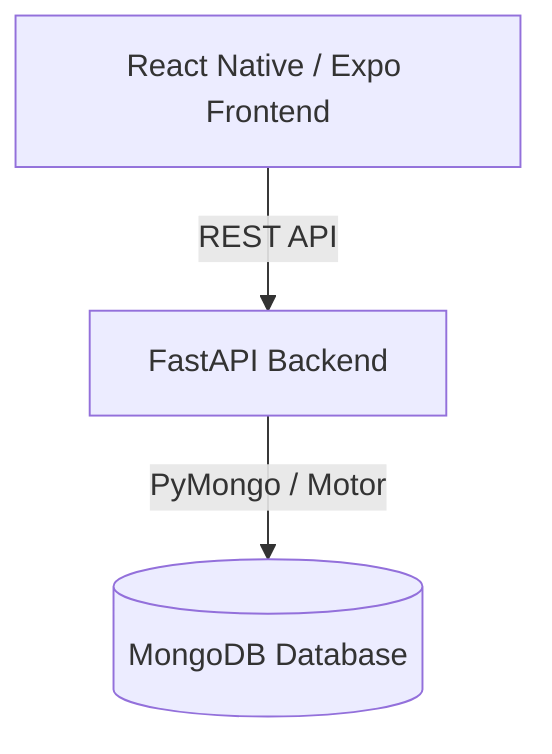

# AthliTech — Premium Athletic Performance Platform (V1)

AthliTech is a universal athlete and coach management platform built for tracking workouts, monitoring physical performance logs, and managing role-based access control (RBAC).

## Architecture Overview

*   **Frontend**: Built with React Native and Expo Router, featuring cross-platform routing, custom themed designs, interactive layout engines, and secure local token storage.
*   **Backend**: Powered by FastAPI (Python), utilizing asynchronous MongoDB queries (via Motor) and JWT-based authentication with role-based validation filters.
*   **Database**: MongoDB database store holding `users`, `athletes`, `workouts`, `performances`, and dynamic `roles` collections.

---

## Technical Features Implemented (V1 Production Release)

### 1. Cross-Platform Secure Token Storage
*   Authenticates users and dynamically maps token persistence based on execution environment.
*   Uses **Expo SecureStore** on native iOS and Android to prevent decryption or hijacking.
*   Falls back to standard **localStorage** when running on Web browsers.

### 2. Role-Based Access Control (RBAC) & Dynamic Permissions
*   Dynamic database roles mapping specific granular permissions (e.g. `read:all`, `write:workout`, `read:performance`).
*   Pre-seeded default user profiles:
    *   **Admin**: `admin@athlitech.com` / `Admin@2024!`
    *   **Coach**: `coach@athlitech.com` / `Coach#99ab`
    *   **Athlete**: `athlete@athlitech.com` / `Athlete1$x`
*   Robust backend route protections to prevent privilege escalation or data leakage.

### 3. Lightweight Dashboard Summary APIs
Exposes optimized summary calculations:
*   `GET /dashboard/admin/summary` — Returns counts of users, coaches, athletes, roles, workouts, and performances.
*   `GET /dashboard/coach/{coach_id}/summary` — Returns stats on assigned athletes, workouts assigned/completed/pending, and total performance records.
*   `GET /dashboard/athlete/{athlete_id}/summary` — Returns stats on total workouts, status breakouts, and completion rates.

### 4. Advanced Query Capabilities (Pagination, Filtering, Search)
*   **Pagination**: Supported on all user, athlete, and workout listings via `skip` and `limit` query criteria.
*   **Search**: Fully supports string regex matching (case-insensitive name, email, workout titles, and description searches).
*   **Filters**: Allows role, status, and sport event filters.

### 5. High-Performance Batch DB Queries
*   Resolves performance scaling issues by rewriting N+1 DB operations into single-query `$in` operations, reducing collection scan bottlenecks.

### 6. Cascading Referential Integrity
*   Cascades the deletion of athlete and coach users to prevent dangling document references across workouts, athlete logs, and performance tables.

---

## Documentation Links

*   [**Run & Setup Guide**](docs/run-guide.md): Step-by-step instructions on setting up, seeding, and running the frontend and backend.
*   [**Deployment Checklist**](docs/deployment-checklist.md): Production deployment best practices, environment variables, security protocols, and validation checklist.
