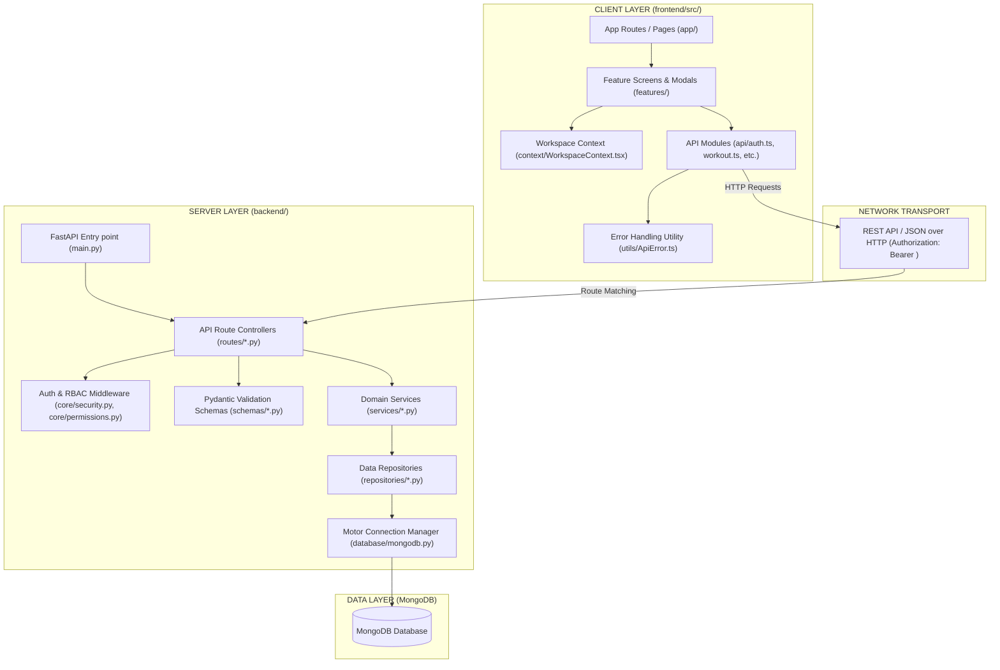

# AthliTech — System Architecture Documentation

This document provides the official technical architecture specification for the **AthliTech** athletic performance tracking and workspace orchestration platform. It documents the implemented v1.2.0-stable codebase baseline.

---

## 1. Architecture Overview

AthliTech follows a decoupled, multi-tier client-server architecture:

```
[User Interface / Web Client]
          │
          ▼
[React Native / Expo Router (Frontend)]
          │
          ▼  (REST API / JSON over HTTP + JWT Bearer)
[FastAPI Router & Middleware (Backend)]
          │
          ▼  (Dependency Injection / Security Filters)
[Domain Service Layer]
          │
          ▼  (Collection Data Abstractions)
[Repository Layer]
          │
          ▼  (Motor Async Driver)
[MongoDB Database]
```

### Architectural Subsystem Locations

| Subsystem / Concern | Core Implementation Files |
| :--- | :--- |
| **Authentication & Tokens** | `backend/core/security.py`, `backend/services/auth_service.py`, `frontend/src/api/auth.ts` |
| **RBAC & Permissions** | `backend/core/permissions.py`, `backend/services/auth_service.py` (`require_admin`, `normalize_role`) |
| **Workspace / Role Hub** | `backend/routes/role_profile_routes.py`, `backend/services/role_profile_service.py`, `frontend/src/context/WorkspaceContext.tsx` |
| **Profile Management** | `backend/routes/profile_routes.py` (`/profile/complete`, `/profile/me`), `backend/services/profile_service.py`, `frontend/src/api/profile.ts` |
| **Athlete Management** | `backend/routes/athlete_routes.py`, `backend/services/athlete_service.py`, `frontend/src/features/athletes/` |
| **Coach Management** | `backend/routes/athlete_routes.py` (`/coaches/{coach_id}/athletes`), `frontend/src/features/coaches/` |
| **Workout Management** | `backend/routes/workout_routes.py`, `backend/services/workout_service.py`, `backend/repositories/workout_repository.py`, `frontend/src/api/workout.ts` |
| **Performance Tracking** | `backend/routes/performance_routes.py`, `backend/services/performance_service.py`, `frontend/src/api/performance.ts` |
| **Admin Functionality** | `backend/routes/dashboard_routes.py`, `backend/routes/user_routes.py`, `backend/routes/role_routes.py`, `frontend/src/features/admin/` |
| **Error Handling** | `frontend/src/utils/ApiError.ts`, `backend/schemas/` (Pydantic validation), `Promise.allSettled` in screens |
| **Database Connection** | `backend/database/mongodb.py` (`AsyncIOMotorClient`) |

---

## 2. Complete Architecture Diagram



---

## 3. Frontend Architecture

The frontend is structured around clear separation between navigation, state management, UI rendering, and API communication.

```
frontend/src/
├── api/          # Typed HTTP API client modules
├── app/          # Expo Router file-based navigation routes
├── components/   # Presentational UI components (WorkoutCard, Layout)
├── constants/    # API endpoints & theme colors
├── context/      # React Context providers (WorkspaceContext)
├── features/     # Domain feature modules (admin, athletes, auth, coaches, workouts)
├── hooks/        # Custom React hooks (useWorkoutSession)
└── utils/        # Utilities (ApiError parser)
```

### Architectural Component Layers

#### 1. Route Navigation Layer (`frontend/src/app/`)
* **Purpose:** Handles URL mapping, screen mounting, and route transitions via Expo Router (v6).
* **Key Files:** `app/index.tsx`, `app/login.tsx`, `app/role-hub.tsx`, `app/workout-library.tsx`, `app/athlete-dashboard.tsx`, `app/coach-dashboard.tsx`.
* **Communication:** Renders corresponding domain screens from `features/` and passes route parameters.

#### 2. Feature Screen Layer (`frontend/src/features/`)
* **Purpose:** Encapsulates domain-specific visual layouts, modals, and local component states.
* **Key Folders:**
  * `features/auth/`: Login and registration UI forms (`LoginScreen.tsx`).
  * `features/athletes/`: Athlete personal dashboard and detailed performance screens (`AthleteDashboardScreen.tsx`, `AthleteDetailsScreen.tsx`).
  * `features/coaches/`: Coach management dashboards and athlete detail views (`CoachDashboardScreen.tsx`, `CoachDetailsScreen.tsx`).
  * `features/workouts/`: Workout Library screen and interactive Workout Cards (`WorkoutLibraryScreen.tsx`, `WorkoutCard.tsx`).
  * `features/admin/`: System management metrics and role administration (`AdminDashboard.tsx`).
* **Communication:** Reads workspace state from `WorkspaceContext`, calls functions in `api/`, and renders sub-components from `components/`.

#### 3. API Communication Layer (`frontend/src/api/`)
* **Purpose:** Isolates all backend HTTP requests from React UI rendering.
* **Key Files:** `auth.ts`, `workout.ts`, `performance.ts`, `profile.ts`, `roleHub.ts`, `organization.ts`, `admin.ts`.
* **Communication:** Imports `API_URL` and token getters from `constants/api`, executes `fetch` requests, and uses `ApiError` utility to throw formatted errors.

#### 4. Global State & Context (`frontend/src/context/WorkspaceContext.tsx`)
* **Purpose:** Manages active user workspace roles (`athlete`, `coach`, `organization`), current active workspace role, workspace status loading, and error states.
* **Key Exports:** `WorkspaceProvider`, `useWorkspace()`.
* **Role Switching Mechanics:**
  1. User triggers workspace switch in UI.
  2. `setCurrentWorkspace(targetRole)` updates local state and persists selection to `localStorage`.
  3. `refreshWorkspaceStatus()` calls `fetchRoleHubStatus()` to sync active profile subscriptions.
  4. Active screen re-renders the appropriate role dashboard.

#### 5. Custom Hooks & Error Utilities (`frontend/src/hooks/`, `frontend/src/utils/`)
* **Key Files:** `hooks/useWorkoutSession.ts`, `utils/ApiError.ts`.
* **`ApiError.ts` Purpose:** Parses raw backend error bodies (strings, Pydantic validation error lists, JSON objects) into standard `ApiError` instances containing HTTP status codes and user messages.

---

## 4. Backend Architecture

The backend implements a clean, layered service-repository pattern using FastAPI.

```
backend/
├── core/         # Security, JWT helpers, permissions, constants, config
├── database/     # Motor MongoDB client setup & collection instances
├── models/       # Python dataclasses/Pydantic domain models
├── repositories/ # Abstract data access functions over Motor
├── routes/       # FastAPI endpoint controllers & parameter dependencies
├── schemas/      # Pydantic request and response schemas
├── services/     # Business logic, RBAC rules, orchestration
└── main.py       # FastAPI application entry point
```

### Layer Responsibilities

1. **Routes (`backend/routes/*.py`):** Define HTTP verbs, URL paths, input payload binding, and dependency injection (`Depends(get_current_user)`). Routes do not write database queries directly.
2. **Schemas (`backend/schemas/*.py`):** Pydantic v2 schemas defining input validation rules (e.g., email format, required set/rep integers) and output serialization.
3. **Services (`backend/services/*.py`):** Encapsulate business logic, role permission checks, password hashing, and cross-repository orchestration.
4. **Repositories (`backend/repositories/*.py`):** Encapsulate PyMongo / Motor collection operations (`find`, `find_one`, `insert_one`, `update_one`, `delete_one`).
5. **Database (`backend/database/mongodb.py`):** Initializes `AsyncIOMotorClient` and exposes collection handles (`db["users"]`, `db["workouts"]`, `db["athletes"]`, etc.).
6. **Core (`backend/core/`):**
   * `security.py`: Password hashing via `bcrypt` package and JWT encoding/decoding via `jose.jwt`.
   * `permissions.py`: Role string normalization (`ROLE_ATHLETE`, `ROLE_COACH`, `ROLE_ADMIN`).
   * `config.py`: Environment configuration loading (`MONGODB_URI`, `JWT_SECRET`).

### Real End-to-End Request Trace

Below is the step-by-step lifecycle of a **`POST /workouts`** (Create Workout Plan) request:

```
[1. Frontend]
  User clicks "Assign Workout" in Coach Dashboard
  frontend/src/api/workout.ts -> createWorkout(token, workoutData)
          │  (HTTP POST /workouts with Bearer Header)
          ▼
[2. Route Layer]
  backend/routes/workout_routes.py -> create_workout(payload, current_user=Depends(get_current_user))
          │
          ├─► [3. Auth Dependency]
          │     backend/services/auth_service.py -> get_current_user(token)
          │     backend/core/security.py -> decode_access_token(token)
          │     backend/database/mongodb.py -> users_collection.find_one({"_id": user_id})
          │
          ├─► [4. Pydantic Schema Validation]
          │     backend/schemas/workout_schema.py -> WorkoutCreate(**payload) validates title, category, exercises
          │
          ▼
[5. Service Layer]
  backend/services/workout_service.py -> create_workout(workout_data, current_user)
  Enforces role checks (User must be coach or admin)
          │
          ▼
[6. Repository Layer]
  backend/repositories/workout_repository.py -> insert_workout(doc)
          │
          ▼
[7. Database Layer]
  Motor driver executes insert into MongoDB `db["workouts"]` collection
          │
          ▼
[8. JSON Response Return]
  Service returns created document -> FastAPI serializes via WorkoutResponse -> 200 OK JSON response
          │
          ▼
[9. Frontend Update]
  handleResponse() returns result -> Coach Dashboard updates athlete workout assignment UI
```

---

## 5. Database Architecture

AthliTech uses **MongoDB** as an asynchronous document database. Collections store flexible JSON-like BSON documents.

### Connection Manager (`backend/database/mongodb.py`)

* **Client:** `AsyncIOMotorClient` initialized using `MONGODB_URI`.
* **Async Loop Binding:** Binds `AsyncIOMotorClient` to the running asyncio event loop (`client.get_io_loop = asyncio.get_running_loop`).

### MongoDB Collections & Relationships

| Collection Name | Primary Identifier | Key Fields | Document Relationships / References |
| :--- | :--- | :--- | :--- |
| `users` | `_id` (ObjectId/str) | `email`, `hashed_password`, `role`, `profile_completed` | Base account record referenced by `athlete_id` & `coach_id` |
| `athletes` | `_id` / `athlete_id` | `name`, `sport`, `event`, `coach_id`, `height_cm`, `weight_kg` | `athlete_id` references `users._id`; `coach_id` references `users._id` |
| `workouts` | `_id` / `id` | `title`, `category`, `sport`, `exercises` (array), `created_by` | `created_by` references user ID; assigned to athletes via `workout_assignments` |
| `performances` | `_id` / `id` | `athlete_id`, `metric_name`, `value`, `unit`, `date` | `athlete_id` references `users._id` or `athletes.athlete_id` |
| `performance_logs` | `_id` / `id` | `athlete_id`, `workout_id`, `exercise_name`, `sets_completed` | Connects performance metrics to specific completed workouts |
| `workout_assignments` | `_id` / `id` | `workout_id`, `athlete_id`, `coach_id`, `assigned_at`, `status` | Junction document connecting coach, athlete, and assigned workout |
| `workout_sessions` | `_id` / `session_id`| `athlete_id`, `workout_id`, `current_exercise_index`, `timer_seconds` | Active execution runner state |
| `roles` | `_id` / `id` | `name`, `permissions` (string array e.g. `["read:all", "write:workout"]`) | Defined RBAC role permissions |
| `accounts` | `_id` / `account_id` | `email`, `role`, `status` | Single-identity root account document |
| `organizations` | `_id` / `org_id` | `name`, `owner_id`, `members_count` | Organization entity record |
| `memberships` | `_id` | `account_id`, `organization_id`, `roles` (array) | Organization user membership |
| `role_profiles` | `_id` | `account_id`, `active_roles` (array), `current_workspace` | Workspace Role Hub state |

---

## 6. Authentication & Authorization Architecture

Authentication and permission validation follow an OAuth2 Bearer token architecture.

```
User Input (email, password)
      │
      ▼
[POST /auth/login]
      │
      ▼
Verify Password (bcrypt module in core/security.py)
      │
      ▼
Create Access Token (jose.jwt.encode with HS256, 60-min expire)
      │
      ▼
Return JWT Token Response
      │
      ▼
Client Stores Token (Expo SecureStore / Web localStorage)
      │
      ▼
Subsequent Request Header: "Authorization: Bearer <JWT>"
      │
      ▼
[get_current_user Dependency] (services/auth_service.py)
      │
      ▼
Decode Token -> Lookup User in MongoDB -> Resolve Workspace Role Profiles -> Attach user dict to Request
      │
      ▼
[Permission Filter / Route Handler Executed]
```

### Key Security Modules

* **Password Hashing:** `core/security.py` uses `bcrypt` module (`hash_password`, `verify_password`).
* **JWT Creation & Verification:** `core/security.py` uses `jose.jwt` (`create_access_token`, `decode_access_token`).
* **Role Normalization:** `core/permissions.py` maps string roles to standard constants (`athlete`, `coach`, `admin`, `org_admin`).
* **Protected Dependencies:**
  * `get_current_user`: Decodes JWT, validates active account status, fetches user document.
  * `require_admin`: Verifies `user["role"] == "admin"`.

---

## 7. End-to-End Feature Architecture

### A. Athlete End-to-End Flow
1. **Registration:** `POST /auth/register` creates account with base role `athlete`.
2. **Login:** `POST /auth/login` returns JWT token.
3. **Profile Completion:** Athlete submits physical stats (`POST /profile/complete`); updates `athletes` collection and sets `profile_completed=True`.
4. **Workspace Unlock & Dashboard:** `AthleteDashboardScreen` fetches athlete summary and assigned coach details.
5. **Workout Library Exploration:** `WorkoutLibraryScreen` queries `GET /workouts` (3-column desktop grid).
6. **Workout Execution:** `useWorkoutSession` hook manages execution timer and sends status updates (`PUT /workouts/{id}/status`).
7. **Performance Logging:** `POST /performance/` logs metric entries to `performances` collection.

### B. Coach End-to-End Flow
1. **Login & Workspace Entry:** Coach logs in and enters `CoachDashboardScreen`.
2. **My Athletes:** Queries `GET /coaches/{coach_id}/athletes` to fetch assigned athletes.
3. **Athlete Details Inspection:** `AthleteDetailsScreen` runs `Promise.allSettled` queries to pull athlete stats, assigned workouts, and performance history.
4. **Workout Assignment:** Coach selects template or custom exercise list; `POST /workouts` creates workout assignment for target athlete.
5. **Performance Monitoring:** Coach views updated workout status and performance history metrics.

### C. Admin End-to-End Flow
1. **Login:** Admin logs in using administrative credentials.
2. **Dashboard Overview:** `AdminDashboard` queries `GET /dashboard/admin/summary` to view global system counters.
3. **User & Role Administration:** Admin fetches user directory (`GET /users/all`) and permission matrix (`GET /roles/all`).
4. **Organization Management:** Queries `GET /organization/my-organization` and invitation statuses.

### D. Workspace Role Hub Flow
1. **Role Hub Access:** User visits `/role-hub` (`RoleHubScreen.tsx`).
2. **Role Activation:** User clicks activate role (`POST /role-profiles/activate` with target role `'athlete'`, `'coach'`, or `'organization'`).
3. **Workspace Switch:** `setCurrentWorkspace(role)` updates context state and switches top-level navigation routes without re-authenticating.

---

## 8. Architectural Decisions

| Decision | Implementation | Rationale |
| :--- | :--- | :--- |
| **FastAPI Framework** | Python 3.12 + FastAPI | Provides high-performance async execution, native Pydantic validation, and automatic OpenAPI documentation. |
| **MongoDB Document Store** | Motor Async Driver | Flexible schema accommodates exercise arrays, varying athletic metrics, and rapid iteration without complex SQL migrations. |
| **Pydantic Schemas** | Pydantic v2 | Strictly enforces data validation on inbound HTTP payloads and controls outbound API JSON formatting. |
| **JWT Authentication** | OAuth2 Bearer Tokens | Stateless authentication enables secure cross-platform execution (Native mobile & Web) without server session state. |
| **Service-Repository Pattern** | Decoupled `services/` & `repositories/` | Separates transport/HTTP routes from business logic and database driver calls, making code testable and maintainable. |
| **Workspace Context & Role Hub** | `WorkspaceContext.tsx` + `role_profiles` | Enables a single user account to hold multiple active roles (Athlete, Coach, Org Admin) without duplicate login accounts. |
| **Centralized ApiError Parser** | `frontend/src/utils/ApiError.ts` | Normalizes network errors, HTTP status codes, and Pydantic validation error lists into clean UI alert messages. |

---

## 9. Future Architecture Extensions

> [!IMPORTANT]
> The features below represent **future architectural extensions** and are not currently implemented as active code in this release baseline.

* **AI Performance & Recommendation Engine:** Integration of machine learning services (e.g., PyTorch / TensorFlow models) for predictive athlete fatigue modeling and automated workout adjustment.
* **Real-Time WebSockets Transport:** Replacing REST polling with WebSocket connections for real-time live workout session monitoring and instant messaging between coaches and athletes.
* **Stripe Payment & Subscription Gateway:** Integrating Stripe webhook handlers and subscription payment flows to process real monetary subscriptions for organization roles.
* **Microservices Containerization:** Partitioning the FastAPI monolith into decoupled microservices (Auth Service, Workout Service, Analytics Service) managed via Docker and Kubernetes.

---

## 10. Mentor Review Cheat Sheet (Architecture Q&A)

### Q1: Why are routes separated from services in the backend?
**Answer:** Routes (`routes/`) handle HTTP request binding, URL parameter extraction, and status codes. Services (`services/`) contain pure business logic and security policies. This separation prevents database/business logic leaks into transport layers and allows services to be unit-tested independently.

### Q2: Why do we need a repository layer?
**Answer:** The repository layer (`repositories/`) abstracts MongoDB driver calls (`Motor`/`PyMongo`). If the underlying database queries or collection schemas change, only the repository needs modification, leaving service business logic untouched.

### Q3: What is the role of Pydantic schemas?
**Answer:** Pydantic schemas (`schemas/`) validate incoming JSON request payloads against expected types before reaching endpoint functions, returning automatic HTTP 422 errors for invalid data. They also format and sanitize outbound response JSON.

### Q4: Where is JWT created and verified?
**Answer:** JWT creation occurs in `backend/core/security.py` (`create_access_token`) during login (`services/auth_service.py`). JWT verification occurs in `backend/core/security.py` (`decode_access_token`) via the FastAPI dependency `get_current_user`.

### Q5: How does Role-Based Access Control (RBAC) work in this codebase?
**Answer:** User roles are stored in user documents and role profiles. Protected routes inject security dependencies like `require_admin` or inspect `current_user["role"]` to verify permission arrays before executing service actions.

### Q6: How does frontend communicate with FastAPI?
**Answer:** Frontend API modules (`frontend/src/api/`) use the `fetch` API to send HTTP requests to FastAPI endpoints, attaching the JWT token in the `Authorization: Bearer <token>` header. Standardized `handleResponse` helper functions parse responses or throw `ApiError` instances.

### Q7: Why MongoDB instead of a Relational Database?
**Answer:** Sports workouts and performance telemetry consist of hierarchical, dynamic structures (e.g., nested exercise arrays with sets, reps, and durations). MongoDB document models naturally represent these nested structures without requiring multi-table SQL joins.

### Q8: What is the purpose of WorkspaceContext?
**Answer:** `WorkspaceContext.tsx` maintains global state for the user's active workspace role (`athlete`, `coach`, `organization`), active role subscriptions, loading state, and error handling across frontend screens.

### Q9: How does workspace/role switching work?
**Answer:** The user selects a role in the Role Hub (`/role-hub`). The frontend calls `activateRole()`, updates `WorkspaceContext`, and stores the active workspace choice in local storage, causing the application to mount the corresponding role dashboard without requiring a re-login.

### Q10: What happens when an API request fails on the frontend?
**Answer:** `ApiError.ts` parses the failure response (extracting HTTP status code and message details) and throws a typed `ApiError`. Complex screens use `Promise.allSettled` to catch individual failures gracefully so other dashboard components continue rendering.
